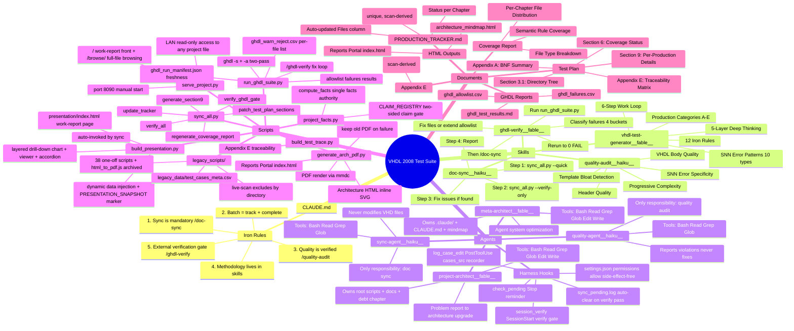
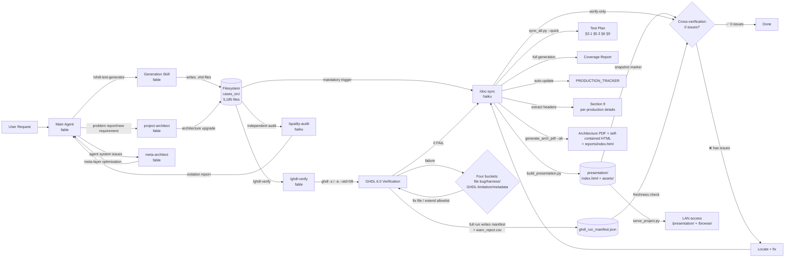

# VHDL 2008 Test Suite — Architecture Reference

> Generated on 2026-09-04 · verified by `sync_all.py` when architecture files change
>
> This document is the project's **single source of truth for architecture**. Any architecture change (adding/removing skills, agents, scripts, or document outputs) must update this file.
> `sync_all.py --verify-only` enforces that this file matches the actual filesystem: 4 skills, 4 agents, 7 root scripts, and the key concept tokens (`ghdl` / `index.html` / `presentation`) must all be present. The harness layer (settings.json + 3 hooks + sync_pending.log) is documented in §2.1 and the mermaid Agents branch.

---

## 1. Architecture Mindmap

---

## 2. Component Reference

### 2.1 CLAUDE.md — Project Orchestration Hub

| Property | Value |
|---|---|
| **Path** | `CLAUDE.md` |
| **Role** | Top-level instruction file for the main agent |
| **Contents** | Iron Rules (6 iron rules, each annotated with its enforcement mechanism — incl. Iron Rule 6: facts come from one source), Harness Enforcement Layer (settings.json + 3 hooks + sync_pending.log), Memory Policy, Skill list (4), key-path quick reference, script quick reference |
| **Design principle** | Lean orchestration — tells the main agent only **when to invoke which skill**, never duplicates the methodology inside the skills |

**Why it exists**: CLAUDE.md is the first file an AI agent reads when entering the project. It defines "who does what, when, and what counts as done". All detailed methodology lives in the skill files; CLAUDE.md only orchestrates.

**Relationships with other components**:
- Points to → 4 Skills (`/vhdl-test-generator`, `/doc-sync`, `/quality-audit`, `/ghdl-verify`)
- Points to → 4 Agents (`sync-agent`, `quality-agent`, `project-architect`, `meta-architect`)
- Points to → 7 root scripts (script quick-reference table — details in §2.4)
- Points to → facts authority `project_facts.py` (Iron Rule 6: every factual claim derives from compute_facts()/CLAIM_REGISTRY; verified by `verify_fact_claims()` step 7k)
- Does not contain → the full text of the 12 Iron Rules (they live in the `vhdl-test-generator` skill — the single definition site)

**Harness Enforcement Layer**: `.claude/settings.json` + `.claude/hooks/` upgrades Iron Rules 1/5 from model discipline to machine records + machine reminders (Iron Rule 6 is machine-enforced by `verify_fact_claims()`, step 7k — facts/claims gate). The PostToolUse hook (log_case_edit.py) records every cases_src edit into `.claude/sync_pending.log`; the SessionStart hook (session_verify.py) runs `sync_all.py --verify-only` (exit code 1 = unfinished work, HARNESS GATE context injected; 0 issues = previous edits settled, log auto-cleared); the Stop hook (check_pending.py) reminds about unsettled records. permissions principle: allow contains only side-effect-free commands (write-class commands require confirmation = the gate ritual). The authoritative source for rendered artifacts (reports/architecture_mindmap.html, reports/index.html) is architecture_mindmap.md and the sync pipeline; they are regenerated only by `sync_all.py` / `generate_arch_pdf.py`, and agents never hand-edit them (guaranteed by convention + the verify gate; deny rules are no longer used — in practice deny also blocked the sync subprocess commands that write these paths).

**Memory Policy** (hard-coded in CLAUDE.md): memory stores only user preferences that cannot be derived from the repo; Iron Rules and architecture facts NEVER go into memory (putting them in memory degrades them into soft constraints).

---

### 2.2 Skills

Skills are **reusable methodology packages**. Each skill is a standalone markdown file with frontmatter metadata and detailed operating instructions. Skills are invoked by the main agent via `/skill-name`.

#### 2.2.1 vhdl-test-generator

| Property | Value |
|---|---|
| **Path** | `.claude/skills/vhdl-test-generator.md` |
| **Model** | `fable` (deep reasoning required) |
| **Trigger** | User asks to generate/improve VHD test files |
| **Core contents** | 12 Iron Rules (single definition site), 5-layer deep-thinking framework, 6-step work loop, SNN error-pattern reference, production classification system |
| **Output** | High-quality, non-template `.vhd` test files |

**5-Layer Deep Thinking** (cognitive framework before generating):
1. **Essence**: what role does this BNF production play in VHDL? What is its minimal compiling form?
2. **Variants**: which legal variants exist for each syntax slot? Edge cases? What did VHDL 2008 add?
3. **Types & Usage**: which types are involved? Which custom types can enrich the tests?
4. **Error Modes**: what errors can occur for each BNF token? Which semantic rules are involved?
5. **Test Dimension List**: synthesize the first four layers into a complete SYN/SNN/SEM/SMN list

**6-Step Work Loop** (execution flow per production):
1. Five-layer thinking → 2. Write out the test dimension list → 3. Hand-write VHD file by file → 4. Three-layer consistency check → 5. 12 Iron Rule audit → 6. Invoke `/doc-sync` to refresh documents

**Why the fable model**: test generation requires deep domain knowledge (VHDL syntax/semantics, IEEE 1076-2008) and creative thinking (designing meaningful test scenarios, avoiding templates) — a plain haiku model cannot do this.

#### 2.2.2 doc-sync

| Property | Value |
|---|---|
| **Path** | `.claude/skills/doc-sync.md` |
| **Model** | `haiku` (mechanical work, no deep reasoning needed) |
| **Trigger** | **After any file change** (creating, modifying, deleting `.vhd` files) |
| **Core contents** | 4-step sync protocol (quick → verify → fix → report) — the single source of truth for the sync protocol; other files only reference, never copy |
| **Output** | All documents + HTML/portal consistent with the actual filesystem, `0 issues found` |

**4-Step Protocol**:
1. `sync_all.py --quick` — updates Test Plan, Coverage Report, Section 9, Tracker, Generation Log, **architecture PDF/HTML + portal page**
2. `sync_all.py --verify-only` — cross-verifies consistency of all documents (including the GHDL gate)
3. If issues are found → analyze and fix (missing headers, pipe characters, inaccurate counts, etc.)
4. Report: file counts, production counts, list of updated documents

**Why the haiku model**: sync is mechanical command execution + verification and needs no creative thinking. haiku is sufficient and cheaper.

#### 2.2.3 quality-audit

| Property | Value |
|---|---|
| **Path** | `.claude/skills/quality-audit.md` |
| **Model** | `haiku` |
| **Trigger** | Final quality audit of generated files before marking "done" |
| **Core contents** | Audit procedure (sampling, dimension→rule-number mapping, scripts, report) + references to the rule definitions in /vhdl-test-generator (never copies the rule text) |
| **Output** | Violation list (file + rule number + specific problem), or PASS |

**5 Check Dimensions** (audit dimension → rule-number mapping; rule text lives in `/vhdl-test-generator`, not copied into this skill):
1. **Header Quality**: does `-- Test Focus:` exist, does it describe HOW (not WHAT), does it contain dangerous characters (ASCII `|`)
2. **Template Bloat Detection**: scan for template residue such as `t_uint8`/`t_state`/`bh`; check for lazy defaults like `port(r:out integer)`
3. **SNN Error Specificity**: does the error target a specific BNF token (e.g. "missing `of` keyword" rather than a generic "syntax error")
4. **Progressive Complexity**: is SYN_001 truly minimal, is SYN_00N comprehensive, do intermediate files progress incrementally (thresholds per `/vhdl-test-generator` Rule 8)
5. **VHDL Body Quality**: does the code test the actual syntax elements of this production (rather than an off-topic generic state machine)

**Why it exists**: a generating agent auditing itself is unreliable (proven repeatedly). An independent quality-audit agent provides an objective third-party check. Beyond content audit there are two more independent verification layers: external compilation (`/ghdl-verify`) and document consistency (`/doc-sync`).

#### 2.2.4 ghdl-verify

| Property | Value |
|---|---|
| **Path** | `.claude/skills/ghdl-verify.md` |
| **Model** | `fable` (failure classification needs deep VHDL + GHDL knowledge) |
| **Trigger** | After any `.vhd` change (Iron Rule 5) / verify reports `GHDL GATE:` issues / before marking done / on demand |
| **Core contents** | 7-step protocol (environment → run suite → read results → four-bucket classification → fix → rerun to 0 FAIL → `/doc-sync`) + catalog of known GHDL 6.0 gaps (25 categories) |
| **Output** | `Failures: 0` (non-allowlist) + updated allowlist + result matrix |

**7-Step Protocol**:
1. Ensure GHDL is reachable (winget path + lib on PATH, `--limit 1` smoke test)
2. `run_ghdl_suite.py` (full / `--chapter chXX` / `--limit N`)
3. Read `ghdl_failures.csv` (FAIL rows) + `ghdl_test_results.md` (matrix + Notes counts)
4. **Four-bucket failure classification**: ① file bug (VHDL violates the standard or contradicts its header) ② harness defect (script misjudgment) ③ GHDL limitation (hits the gap catalog → allowlist with reason) ④ metadata misclassification (header Case Type contradicts the file name)
5. Fix (**prefer fixing files**; the allowlist admits only genuine tool gaps)
6. Rerun to 0 FAIL (WARN_REJECT / EXPECTED_FAIL are allowed; they land in the Notes section)
7. Close out with `/doc-sync` (verify 0 issues including the GHDL gate)

**Why the fable model**: distinguishing a "file bug" from a "GHDL tool gap" requires judging whether the VHDL semantics are correct and where the boundaries of GHDL 6.0's known defects lie — haiku cannot make this kind of domain judgment and has repeatedly misclassified tool gaps as file errors.

---

### 2.3 Agents

Agents are **independently executed subprocesses** with a clear single responsibility, a limited toolset, and a specific model. Unlike skills, agents have their own context window, can run in parallel, and never pollute the main agent's context.

#### 2.3.1 sync-agent

| Property | Value |
|---|---|
| **Path** | `.claude/agents/sync-agent.md` |
| **Model** | `haiku` |
| **Tools** | `Bash`, `Read`, `Grep`, `Glob` |
| **Responsibility** | Document sync — this one thing only |

**Workflow** (single source of truth for the sync protocol = the `/doc-sync` skill; the agent file defines only the dispatch protocol and exit criteria):
1. On a sync request → execute per the `/doc-sync` 4-step protocol (quick → verify → fix → report)
2. Exit criteria (hard machine gate): `sync_all.py --verify-only` exits 0 and output contains `0 issues found`
3. Verification failure → handle per the `/doc-sync` Step 3 fix table; never fix `GHDL GATE:` issues on its own — report them to the main agent
4. Report final results (including GHDL gate status, HTML/portal outputs)

**Constraints**:
- Never modifies `.vhd` test files (except fixing the `-- Test Focus:` header)
- Never modifies any root script (`sync_all.py`, `generate_arch_pdf.py`, `run_ghdl_suite.py`, `build_test_trace.py`)
- Never fixes `GHDL GATE:` issues on its own — reports to the main agent: "invoke `/ghdl-verify`"
- Never generates new content

**Why it exists separately**: the main agent focuses on content generation and easily forgets the final sync step. A dedicated sync-agent guarantees documents are updated after every file change — not by memory, but by architecture enforcement.

#### 2.3.2 quality-agent

| Property | Value |
|---|---|
| **Path** | `.claude/agents/quality-agent.md` |
| **Model** | `haiku` |
| **Tools** | `Bash`, `Read`, `Grep`, `Glob` |
| **Responsibility** | Quality audit — reports problems only, never modifies files |

**Workflow** (single source of truth for the audit procedure = the `/quality-audit` skill; rule definitions = `/vhdl-test-generator`; the agent file defines only the dispatch protocol):
1. Read all `.vhd` files in the designated folder
2. Audit file by file per the `/quality-audit` check dimensions (rule-number mapping in that skill) + run the audit script
3. Output the violation list (file name + violated rule number + specific description)
4. Give the final verdict: PASS / FIX N ISSUES / REGENERATE

**Why it exists separately**: a generating agent self-auditing = referee and player in one. An independent agent provides objective quality assessment.

#### 2.3.3 project-architect

| Property | Value |
|---|---|
| **Path** | `.claude/agents/project-architect.md` |
| **Model** | `fable` (architecture design needs deep reasoning) |
| **Tools** | `Bash`, `Read`, `Grep`, `Glob`, `Edit`, `Write` |
| **Responsibility** | Owns the overall project architecture (everything except the agent/skill system) |

**Workflow**: user reports a problem / proposes a new requirement → read the mindmap + CLAUDE.md + relevant scripts → gap analysis → minimal upgrade design (honoring the three principles: single source of truth — incl. facts via project_facts.py — / full regeneration over patching / verify gate) → implement root scripts/pipelines/docs (incl. the facts authority `project_facts.py` + CLAIM_REGISTRY + verify step 7k) → update the relevant mindmap sections + the §8.5 debt chapter (delete resolved items → migration log; add new debts) → `--quick` + `--verify-only` to 0 issues.

**Boundaries**: never edits `.claude/` or `CLAUDE.md` (meta-architect territory); stops and hands off to the main agent when a new skill/agent is needed.

**Why it exists**: architecture upgrades are high-risk multi-file changes (scripts + docs + verification expectations must move together) that the main agent tends to abandon halfway when doing them inline. A dedicated architect turns "problem/new requirement → architecture upgrade" into a fixed flow with protocol, gates, and closeout.

#### 2.3.4 meta-architect

| Property | Value |
|---|---|
| **Path** | `.claude/agents/meta-architect.md` |
| **Model** | `fable` |
| **Tools** | `Bash`, `Read`, `Grep`, `Glob`, `Edit`, `Write` |
| **Responsibility** | Owns the meta layer (the agent/skill system itself) |

**Workflow**: audit all of `.claude/` + CLAUDE.md + mindmap §2.1-2.3/§4 (responsibility overlap, model fit — haiku=mechanical/fable=reasoning, stale references, protocol quality, gate coverage, claim hygiene — agent-system docs carry no unverified factual claims; the meta-domain mindmap sections are 7k scan targets) → optimize directly → update the mindmap + `verify_architecture_diagram()` expectations (the one narrow exception) → verify-only 0 issues.

**Boundaries**: never touches root scripts (except the narrow exception — `project_facts.py`/CLAIM_REGISTRY included; a claim-type extension for agent-system docs is a handoff request), `cases_src/`, the test plan, the tracker, or reports; may add "Agent·Skill Architecture" category entries in §8.5; changes beyond the meta layer are handed off to the main agent (project-architect territory).

**Why it exists**: the agent/skill system is itself the "tool that builds the project" and needs continuous optimization (proven this session: blind-spot verification, responsibility drift, stale references keep recurring — the claim domain is now sealed by `verify_fact_claims()`, step 7k). Having the project architect audit itself would repeat the "generating agent self-audit is unreliable" mistake — an independent meta-architect watches over the builders.

---

### 2.4 Scripts

#### 2.4.1 sync_all.py — Unified Sync Engine

| Property | Value |
|---|---|
| **Path** | `sync_all.py` |
| **Entry point** | `python3 sync_all.py [--quick\|--full\|--verify-only]` |
| **Purpose** | The single sync entry point for the whole document system + report rendering |

**Core Functions and Responsibilities**:

| Function | Responsibility | Update Method |
|---|---|---|
| `scan_filesystem()` | Walks all `.vhd` files under `cases_src/`, counts SYN/SNN/SEM/SMN/Specific per chapter per production | Live scan (single source of truth) |
| `patch_test_plan_sections()` | Updates Test Plan §3.1 (directory tree), §5.3 (totals), §6.1-6.4 (coverage tables), Appendix A, Appendix E | §3.1 patched, §6 + Appx A/E fully regenerated |
| `regenerate_coverage_report()` | Completely regenerates the Coverage Report | Full generation (no patching) |
| `generate_section9()` | Extracts test-point descriptions from each `.vhd` file's `-- Test Focus:` header, groups by (chapter, production), generates the §9 per-production detail tables | Full generation |
| `update_tracker()` | Auto-updates the Files column and Summary table of `PRODUCTION_TRACKER.md` | Auto-written |
| `verify_ghdl_gate()` | GHDL gate: `ghdl_failures.csv` has data rows → reports `GHDL GATE:` issues; **freshness: `ghdl_run_manifest.json` `total_files_at_run` ≠ current file count → reports stale results (manifest written only by full runs, not partial runs; if missing, prompts to rerun `/ghdl-verify`)** | Read-only check |
| `verify_debt_chapter()` | Validates the hand-maintained §8.5 debt chapter (heading present, §8-§9 safe zone, table rows/columns complete, no verify-trap text) | Read-only check |
| `verify_all()` | Cross-verification: Section 9 ↔ filesystem ↔ Tracker ↔ Coverage Report ↔ Appendix E ↔ architecture mindmap ↔ GHDL gate | Read-only check |
| `verify_fact_claims()` | Claim gate (7k): registry patterns in rendered docs must equal `project_facts.py` facts; generator sources must be literal-free; backticked path claims must exist on disk | Read-only check |
| `check_header_quality()` | Scans all VHD headers for Test Focus quality (missing/too short/contains pipe characters/English-only) | Pre-generation check |
| `validate_section9()` | Validates structural completeness of the generated §9 markdown (column alignment, no empty cells) | Pre-write validation |
| `render_test_table()` | Unified markdown table renderer (built-in column-count validation and automatic pipe-character replacement) | DRY principle |

**Three Run Modes**:

| Mode | Refresh Scope | Time | Use Case |
|---|---|---|---|
| `--quick` | §3.1, §5.3, §6, §9, Coverage, Tracker, Log, mindmap timestamp, **architecture PDF + self-contained HTML + portal page**, Test Plan HTML | ~1-3 min | **Daily — after every file change** |
| `--full` | quick + Appendix E + DOCX | ~2-4 min | Phase completion, version release |
| `--verify-only` | Check only, no writes (including the GHDL gate), reports all inconsistencies | ~8s | **The definition of "done"** |

#### 2.4.2 build_test_trace.py

| Property | Value |
|---|---|
| **Path** | `build_test_trace.py` |
| **Purpose** | Regenerates the Appendix E traceability matrix (per-production test point → file mapping) |
| **Invocation** | Auto-invoked by `sync_all.py --full`; can also run standalone |
| **Output** | `Appendix_E_Traceability_Matrix.md` (~12,000 lines, 328 chapter entries) |

#### 2.4.3 generate_arch_pdf.py — Report Renderer

| Property | Value |
|---|---|
| **Path** | `generate_arch_pdf.py` |
| **Purpose** | Renders the architecture mindmap and test plan to PDF / HTML / portal page |
| **Invocation** | `sync_all.py --quick` auto-invokes `--all`; can also run standalone `--mindmap / --archhtml / --testplan / --portal` |

**Output List**:

| Output | Method | Characteristics |
|---|---|---|
| `reports/architecture_mindmap.pdf` | mmdc renders mermaid → PyPDF2 merges | Single architecture-mindmap PDF; **safe replacement**: rendered in a temp directory, the old PDF is replaced only after everything succeeds; on failure (mmdc error / PyPDF2 missing / merge failure) the old PDF is kept and temp files cleaned up — never leaves -1/-2.pdf residue |
| `reports/architecture_mindmap.html` | pandoc MD→HTML + mermaid blocks replaced with **mmdc-rendered inline SVG** | **Fully self-contained, works offline/on intranet**; falls back to CDN mermaid.js if SVG rendering fails (warns, does not abort) |
| `test_plan/VHDL2008_Test_Plan_latest.html` | pandoc + CDN mermaid.js injection | Test Plan HTML (mermaid via CDN, needs network) |
| `reports/index.html` | Static portal page (link table + generation timestamp) | Entry point to all reports, generated last so link targets exist |

#### 2.4.4 run_ghdl_suite.py — GHDL External Verifier

| Property | Value |
|---|---|
| **Path** | `run_ghdl_suite.py` |
| **Purpose** | Fully validates the test suite with the public analyzer GHDL 6.0 (--std=08) |
| **Invocation** | **Invoked via the `/ghdl-verify` skill** (Iron Rule 5), never bare |
| **Arguments** | `--limit N` (smoke) / `--chapter chXX` (by chapter) / `--workers 16` |
| **GHDL discovery** | `shutil.which('ghdl')` → glob `%LOCALAPPDATA%\Microsoft\WinGet\Packages\ghdl*/bin/ghdl.exe` picks the newest version → if none, reports `winget install ghdl.ghdl.ucrt64.mcode` (user paths no longer hard-coded) |
| **Partial runs** | `--limit`/`--chapter` write no reports and no manifest (never pollute the gate) |

**Verdict logic**: two passes per file (`ghdl -s` syntax + `ghdl -a --std=08` analysis; analysis failures automatically retried once to support same-file package visibility); type comes from the `-- Case Type:` header overriding the file name (Negative+SEM→SMN, Positive+SNN→SYN). SYN/SEM must pass; SNN/SMN rejected (including warning-only rejection) = PASS, silently accepted = FAIL.

**Outputs**:

| File | Contents |
|---|---|
| `reports/ghdl_failures.csv` | FAIL rows only — **must be header-only (0 rows)** (basis of the GHDL gate verdict) |
| `reports/ghdl_test_results.md` | Matrix by type/chapter + Notes section (WARN_REJECT / EXPECTED_FAIL counts) + dynamically queried tool versions |
| `reports/ghdl_allowlist.csv` | Known GHDL 6.0 gaps (relpath + reason, 156 rows / 25 categories) — EXPECTED_FAIL not counted as failure |
| `reports/ghdl_warn_reject.csv` | Per-file WARN_REJECT details (relpath, ftype, error_summary) — semantically still counted as PASS (user decision), written only by full runs |
| `reports/ghdl_run_manifest.json` | Written at the end of full runs (files_tested / total_files_at_run / timestamp / suite_version / ghdl_version) — the freshness stamp for `verify_ghdl_gate`; a file-count mismatch reports stale results |

#### 2.4.5 build_presentation.py — Work-Report Page Builder

| Property | Value |
|---|---|
| **Path** | `build_presentation.py` |
| **Purpose** | Generates the single-page work report `presentation/index.html` (fully self-contained: inline CSS + mmdc-rendered inline SVG + vanilla JS, 0 CDN, viewable offline) |
| **Invocation** | **Auto-invoked by `sync_all.py --quick`** (after generate_arch_pdf; node env reused; on failure warns and continues — verify catches it as backstop) |

**Dynamic data (single source of truth)**: all dynamic numbers are injected live at generation time — file/folder/chapter counts, type distribution, SYN_S specific test coverage, English-only Test Focus count, GHDL matrix/chapter tables/Notes/date (parsed from `ghdl_test_results.md`); the mindmap and data-flow SVGs are extracted live from `architecture_mindmap.md` (architecture changes reflected automatically). Historical narrative (phase history/milestones/methodology) is hand-written content.

**Snapshot gate**: at generation time a `PRESENTATION_SNAPSHOT` marker is embedded (files/folders/skills/agents/scripts/ghdl_files); `verify_presentation()` (verify 7j) compares each item against disk + every on-disk skill/agent name must appear in the page (prevents the drill-down chart narrative from falling behind) — an architecture change or test-suite addition/removal without a sync rerun is caught immediately.

**Interactions**: layered drill-down architecture chart (click card to expand → click member for the detail panel), SVG viewer (smart fit/6 buttons/pan clamping/whiteboard fullscreen), phase accordion.

#### 2.4.6 serve_project.py — LAN Full-File Access

| Property | Value |
|---|---|
| **Path** | `serve_project.py` |
| **Purpose** | Read-only LAN access to the whole project (ThreadingHTTPServer + a SimpleHTTPRequestHandler subclass) |
| **Invocation** | **Manual start** (not in the sync loop): `python serve_project.py` (--port default 8090, --bind default 0.0.0.0); Ctrl+C to stop |

**Routes**: `/` → 302 `/presentation/` (work-report page as the front); `/browse/…` → custom directory browser (breadcrumbs, directories-first sorting, name/size/modified time, click to enter directories, direct file download links); all other paths → static serving of any project file (.vhd/.md text preview, .html rendered, everything else downloaded).

**Security**: while running, any host on the LAN can read all project files (explicitly requested by the user) — stop it when done; at startup prints the machine's IPv4, access addresses, and the firewall netsh command.

#### 2.4.7 project_facts.py — Facts Authority & Claim Registry

| Property | Value |
|---|---|
| **Path** | `project_facts.py` |
| **Purpose** | Single source of truth for every factual claim in prose/templates. `compute_facts()` derives all facts from live sources (cases_src filesystem scan, reference CSV totals, tracker title production count, live .claude/ skill/agent/hook counts, living root scripts) — memoized per process, no side effects on import. `CLAIM_REGISTRY` declares the factual-claim patterns (with exempt zones and a priority resolver: each claim is matched by exactly one rule). |
| **Invocation** | Imported by `sync_all.py` (verify step 7k) and `build_presentation.py` (placeholder injection); never run standalone |
| **Gate** | `verify_fact_claims()` (verify 7k) is two-sided: output claims must equal the facts (presentation / mindmap / README / coverage / tracker / test plan, exempt zones removed) and generator sources must be literal-free (any digit-bearing registry match in build_presentation.py / generate_arch_pdf.py / build_test_trace.py is a hardcoded fact — placeholders contain no digits, so a source match IS a literal); backticked repo-relative path claims in README + mindmap must exist on disk |

#### 2.4.8 legacy_scripts/ — One-Off Script Archive

| Property | Value |
|---|---|
| **Path** | `legacy_scripts/` |
| **Contents** | 38 one-off generation/fix scripts (build_ch*.py, batch_ch*.py, enhance_*.py, fix_*.py, gen_*.py, refresh_docs.py, generate_section7.py, make_pdf*.py, update_*.py, etc.) + html_to_pdf.js + legacy_data/test_cases_meta.csv (doubled-path bug, no consumers, archived together) |
| **Archived** | 2026-08-20 (P3 repository hygiene) |
| **live-scan** | `sync_all.py`'s `live_root_scripts()` excludes by directory: root .py files − files inside legacy_scripts/ = 7 core scripts, all of which must appear in this mindmap. The directory is the single source of truth, replacing the old hard-coded list |
| **verify semantics** | `.py` names mentioned in backticks in the mindmap may live in the root directory, `.claude/` (hooks, M2), or `legacy_scripts/` (P3 extended existence check) |

---

### 2.5 Documents

All documents are auto-maintained by `sync_all.py` — **never hand-edit documents containing dynamic numbers**.

| Document | Path | Update Method | Contents |
|---|---|---|---|
| **Test Plan** | `test_plan/VHDL2008_Grammar_Semantic_Test_Plan.md` | `sync_all.py --quick` updates §3.1/§5.3/§6/§9/Appx A/Appx E | The complete test plan — strategy, architecture, statistics, per-production test points |
| **Coverage Report** | `reports/coverage_summary.md` | Completely regenerated | Per-chapter file distribution, type distribution, semantic-rule coverage, specific test statistics |
| **PRODUCTION_TRACKER** | `PRODUCTION_TRACKER.md` | Files column + Summary table auto-updated | Production status tracking (counts scan-derived; DONE/GOOD/THIN/EMPTY) |
| **Appendix E** | `test_plan/Appendix_E_Traceability_Matrix.md` | Regenerated in `--full` mode | Traceable mapping of per-production test points → files |
| **Generation Log** | `logs/generation.log` | One timestamped entry appended per sync | Who, when, what changed |
| **Architecture Mindmap** | `reports/architecture_mindmap.md` | Timestamp auto-updated; after manual content edits, `verify` checks consistency | **This document** — the single source of truth for architecture |
| **Architecture PDF / HTML** | `reports/architecture_mindmap.pdf` + `architecture_mindmap.html` | Re-rendered by `generate_arch_pdf.py` on every sync | Mindmap PDF (mmdc) + self-contained HTML (inline SVG, offline) |
| **Reports Portal** | `reports/index.html` | Regenerated on every sync | Entry page to all reports |
| **GHDL Reports** | `reports/ghdl_test_results.md` + `ghdl_failures.csv` + `ghdl_allowlist.csv` | Generated by the `/ghdl-verify` flow; `verify` gates on the failures CSV | External verification results and the tool-gap list |
| **Presentation** | `presentation/index.html` + `assets/` (5 attachment copies) | **Rebuilt by `build_presentation.py` on every sync** (dynamic data injection + snapshot marker); `verify_presentation()` checks the snapshot against disk | Single-page work report (drill-down architecture chart / viewer / phase history / live data tables), accessed over LAN via `serve_project.py` |

---

## 3. Data Flow

**Data Flow Notes**:
1. User request enters the main agent → the main agent invokes the `/vhdl-test-generator` skill to generate VHD files
2. After files are written to `cases_src/` → **mandatory** `/doc-sync` invocation (CLAUDE.md Iron Rule #1)
3. `/doc-sync` runs `sync_all.py --quick` → all documents update in sync
4. `verify-only` checks all documents against the filesystem → `0 issues` = done
5. `/quality-audit` checks file content quality as an **independent audit layer** → reports to the main agent
6. **GHDL fix loop**: `/ghdl-verify` runs `run_ghdl_suite.py` → four-bucket failure classification → fix files or extend the allowlist → rerun to 0 FAIL, then merge into `/doc-sync` (Iron Rule #5 external verification gate). Full runs end by writing the `ghdl_run_manifest.json` freshness stamp + the `ghdl_warn_reject.csv` per-file list; verify reports "stale results" when the file count differs from the last run
7. **Report rendering**: at the end of sync, `generate_arch_pdf.py --all` produces the architecture PDF, self-contained HTML (inline SVG, viewable offline), Test Plan HTML, and the `reports/index.html` portal page; the PDF is safely replaced (rendered to a temp location, replaced only after success, old PDF kept on failure)
8. **Work-report page rebuild**: sync then calls `build_presentation.py` to rebuild `presentation/index.html` (dynamic data injected live + PRESENTATION_SNAPSHOT marker); verify 7j checks the snapshot against disk and reports any drift — after architecture changes or test-suite additions/removals the presentation never lags
9. **LAN access**: `serve_project.py` (manual start, port 8090) fronts `/` to the work-report page and serves full project file browsing/download at `/browse/` — any host on the LAN can view the report and any project file; read-only, stop when done
10. **Architecture upgrade loop**: user reports a problem / proposes a new requirement → main agent dispatches `project-architect` → gap analysis + minimal upgrade → update the mindmap and the §8.5 debt chapter → verify 0 issues
11. **Meta-layer optimization loop**: agent/skill behavior problems / new-role needs → main agent dispatches `meta-architect` → audit + direct optimization → update the mindmap and verify expectations → verify 0 issues

---

## 4. Architecture Stats

| Component | Count | Files |
|---|---|---|
| Skills | 4 | `vhdl-test-generator` (fable), `doc-sync` (haiku), `quality-audit` (haiku), `ghdl-verify` (fable) |
| Agents | 4 | `sync-agent` (haiku), `quality-agent` (haiku), `project-architect` (fable), `meta-architect` (fable) |
| Harness Hooks | 3 | session_verify (SessionStart), log_case_edit (PostToolUse), check_pending (Stop) — plus `.claude/sync_pending.log` machine record |
| Iron Rules | 6 | Sync-Mandatory, Batch-Track, Quality-Verified, Method-In-Skills, External-Verification-Gate, Facts-One-Source |
| Scripts | 7 | `sync_all.py`, `build_test_trace.py`, `generate_arch_pdf.py`, `run_ghdl_suite.py`, `build_presentation.py`, `serve_project.py`, `project_facts.py` |
| Auto-maintained Docs | 12 | Test Plan, Coverage Report, Tracker, Appendix E, Generation Log, Architecture Mindmap .md, Architecture PDF, Architecture self-contained HTML, Test Plan HTML, Reports Portal `index.html`, GHDL reports (results/failures/allowlist), Presentation (`presentation/index.html` + assets/) |

---

## 5. Design Principles

1. **Single source of truth**: each concept (12 Iron Rules, sync protocol, quality-audit criteria, GHDL verification protocol) is defined exactly once, in its skill file. CLAUDE.md never duplicates.
2. **Separation of concerns**: generation (fable), sync (haiku), audit (haiku), and external verification (fable) are independent. No agent does two jobs at once.
3. **Mandatory gating**: `verify-only` returning 0 = the only definition of done. Enforced by script, not memory.
4. **Full regeneration over patching**: documents that can be fully generated (Coverage Report, Section 6, Section 9) are never patched line by line. Patch mode is the root cause of silent staleness.
5. **DRY rendering**: table generation has exactly one function, `render_test_table()` — change it in one place, it takes effect everywhere.
6. **External verification gate**: GHDL 0-FAIL (non-allowlist) is part of the done definition (Iron Rule 5); GHDL limitations must be explicitly allowlisted with a reason — never silently ignored.
7. **Architecture autonomy**: architecture issues route to the architect team (project-architect owns project architecture, meta-architect owns the agent system); the main agent never makes architecture changes inline; mindmap freshness is enforced by verify (live scan of skills/agents directories + script/token checks).
8. **Explicit debt**: things not done or done poorly must land in the §8.5 debt chapter (deletion = completion + migration log) — never left drifting in conversations to be forgotten.
9. **Presentation inside the sync loop**: the work-report page is auto-rebuilt by sync (dynamic data injection + snapshot gate verify 7j) — after architecture changes or test-suite additions/removals the presentation never lags; LAN access (serve_project.py) is its display channel.
